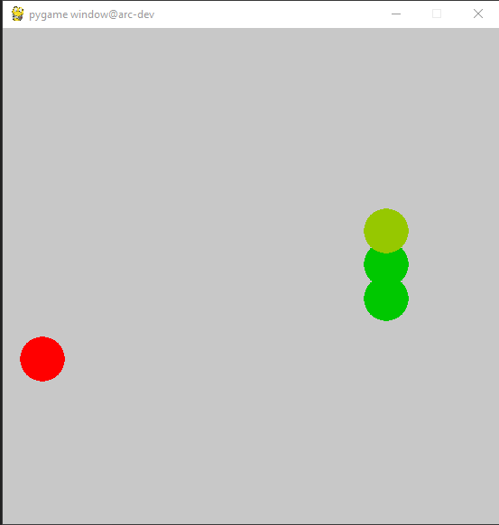
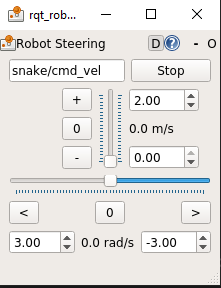

# Running the Snake Tutorial Example
In this section, we will be covering high-level ROS concepts and run the snake game example to see what we will be working towards.

## ROS Concepts
We discussed previously what ROS is, but now we are going to dive into
how ROS works.

In summary, ROS manages a system through 4 key components:
- Nodes: These are independent processes that perform computations. Nodes
 often relate nicely to physical parts within a system, like a camera or an arm.
- Messages: In order for different nodes to communicate, they need messages
 to define the structure of the data they are sending. If a map node wanted
 to tell a navigation node which way to move, it would have to use a message
 (like a 3-point coordinate) to pass that data.
- Topics: Messages help define the type of data we are sending, but topics
 are what deliver the messages. Without topics, a node would never know 
 where to send it's messages. Nodes can either publish or subscribe to a 
 topic, which means they can either receive all messages
 on that topic, send messages to that topic, or both. 
- Services: Topics are nice because it means nodes can send information
 without worrying about if another node receives it. However sometimes it
 may be necessary that a node receives a response from another before moving on.
 This is where services come in; services allow for request / reply interactions.

Here's a helpful visualization of node communication:


As a supplementary resource / explanation, we recommend watching [this
video](https://www.youtube.com/watch?v=bJB9tv4ThV4&list=PLJNGprAk4DF5PY0kB866fEZfz6zMLJTF8&index=2)
until 5 minutes and 53 seconds.

> If some of these concepts aren't yet clear, don't worry. Through the
  walkthrough we will continue to strengthen our understanding.

## Snake Example

Now let's try to apply some of the concepts we've learned to the snake
game. We will start by running the `snakesim` package to see what we will
be controlling. Run the following commands to open our 'dockerized'
environment:
```bash
./src/arc_tutorials/docker/docker-run.sh
```

Pretty much all of the following tutorial assumes that you are working inside
this docker environment. Unless if explicitly said otherwise, assume that
terminal commands are to be run in the Docker container. This is true for all of
the following documents in this tutorial series.

You should now be running a shell within our ARC development container. To
verify that your workspace is correct, run:
```bash
ls catkin_ws
```
If everything is correct, you should simply see a `src/` folder. Let's now
move into our workspace by running:
```bash
cd catkin_ws
```

Now we need to build our workspace, which will setup our environment
to run packages. This will all be explained in the next section, so hang
in there. We do this with the command:
```bash
catkin build
```

Now if we print our directory contents again:
```bash
ls
```

We should see a few new folders, including a `devel/` folder which is 
also important for configuring our environment.

Again this will be covered in the next section, so just run these
commands and it will make sense soon.
```bash
source devel/setup.bash
```

With our workspace and environment fully configured, we can now run the 
packages we have stored.

Lets start by moving into our package directory:
```bash
cd src/arc_tutorials
```

If we print our directory again with `ls`, we should see 5 folders:
- `clock_tutorial/` a deprecated tutorial for ROS in C++
- `docker/` a set of tools to run ARC's docker environment
- `docs/` the collection of documents to follow this tutorial
- `snake_tutorial/` a ROS python package to teach basic control of the 
snake game
- `snakesim/` a ROS python package to run the snake game

In order to run the snake simulation, we will use what is known as a launch
file. It's not important for you to know how a launch file fully works at
the moment, but just know that it starts up ROS nodes in a set way so you
don't have to do it manually.

To run the launch file:
```bash
roslaunch snakesim snakesim.launch
```

Upon running this, two windows should appear. One shows a display of the
snake game and another is a control board for the snake (this is what we
will be replacing). Here's what they look like:

 

> If you get an error message saying `snakesim` is not a package, then 
you need run: `source devel/setup.bash` in the `catkin_ws/` directory.

> If you get an error message about failing to display, it's likely   because X-forwarding is incorrectly setup. Return to 
 [setup tutorial #3](../../docs/03_arc-dev-env.md) for more detail.

To control the snake, you can either move it with WASD keys or
manually adjust the speed with the scroll bars.
Play around with it and see how far you can get.

In this example, we are using only one node and that's to
control the position of the snake. Every time you adjust the speed, you
are sending messages on a topic that the snake node is receiving. These
messages adjust the snake's velocity so it knows what position to move to.

Lets now close both of those windows and use `CTRL + C` in the console
to exit the program. Next we are going to run the snake controller
example to see what we are building towards.

Again we will use a launch file:
```bash
roslaunch snake_tutorial snake.launch
```

The snake game should appear again, but this time it should be
autonomously playing the game. If you watch it long enough, eventually
it will fail because its logic is very simple. By the end of this
tutorial, we will have built this same controller from the ground up.


## Final Notes
Congratulations, you just finished getting familiarized with the snake game
and the controller! You'll develop this same controller by following this
tutorial series. In the next step, you'll create a package to hold your
controller, then you'll write some nodes in order to control the snake.
