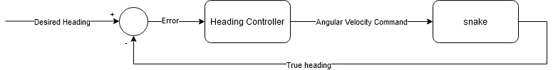

# Heading Controller
## Overview
Since our snake recieves linear and angular velocity inputs, making a heading
controller seems like a good place to start. This will allow us to control the
heading of the snake using feedback control.

Feedback control (also called closed-loop control) means that we are using
sensor readings (in this case the output pose of the snake) in order to create
our control signal that we send to the snake. As a block diagram, it may look
like this:



This node is also going to handle the linear velocity command too. We're just
going to keep that at a constant value in order to keep things simple.

## Creating the Program
Let's go ahead and implement this controller in Python now.

We need to start by creating a new file. In the last tutorial, we were left with
the proper directory structure to start writing code. We need to make a new file
in the `nodes` directory to house our code. We'll call this file
`snake_heading_controller`. 

Note that it is general practice not to add a `.py` file extension to nodes.
This is because the file name becomes the name of the node when building our
package with catkin. Ex: `rosrun snake_controller snake_heading_controller`
is cleaner than `rosrun snake_controller snake_heading_controller.py`.

Let's start the file by writing a shebang and docstring.
```python
#!/usr/bin/env python
"""Node to control the heading of the snake.

License removed for brevity
"""
```
A shebang is a one line comment at the start of the file that tells the
computer how to run it. We will always use `#!/usr/bin/env python` for Python
files. You can read more about them [here](https://en.wikipedia.org/wiki/Shebang_(Unix))

A docstring is a comment in triple double quotes (`"""`) that serves as a
comment for that file, class, function, or method. They are part of the PEP 8
style guide for Python, which we'll be following for our Python code. You can
read more about docstrings [here](https://www.python.org/dev/peps/pep-0257/#what-is-a-docstring),
and more about PEP 8 [here](https://www.python.org/dev/peps/pep-0008/#introduction).

Now, let's move on and start laying the foundation for our file by writing our
`__main__` check and creating a class to hold our logic.
```python
class SnakeHeadingController(object):
    """Simple heading controller for the snake."""
    def __init__(self):
        pass

if __name__ == "__main__":
    SnakeHeadingController()
```
What we've done in the first part of this program is create a class called
`SnakeHeadingController`. A class lets you group methods and variables together
inside an object. It is a key part of Object Oriented Programming (OOP). It is
useful for us, because we're going to have several variables holding data that
we'll need to access from different methods.

This class has a docstring like before, and it only has one method defined,
`__init__`. This function is called when you create a new instance of that class
and is used for initialization. Right now, we've put `pass` inside, which is a
Python keyword meaning "do nothing." It is a handy placeholder because leaving
the body of that function blank would result in an error.

In the second part of the program, we've told the program what to do if it is
executed. The variable `__name__` is set to `__main__` if this file is the main
one being executed. If this file is included in another through `import`, then
the following statements do not get run. We will call this the "`__main__`
check" moving forward. This is the first part of the program that will be
executing commands once ROS starts the node. In this case, it is creating an
instance of our `SnakeHeadingController` class and doing nothing else.

If you'd like, you can run this piece of code from your terminal with the
command:
```bash
./snake_heading_controller
```
> this command works because of the shebang :)

A keen observer will notice that nothing happened, and our program ended
immediately. This is because our code doesn't do anything yet. We call the
second part of our code, which creates an instance of a `SnakeHeadingController`,
which gets initialized through the `__init__` method, which does nothing. You
can put in print commands in various locations if you are confused about the
order in which that all happens:
```python
print "I am here #1"
```

## Creating the Node
Let's start our ROS specific setup now.

Let's modify the body of the `__init__` function to be the following. This is
replacing the `pass` keyword.
```python
        rospy.init_node('snake_heading_controller')

        rospy.spin()
```

Very importantly, we also need to tell Python to import the `rospy` module, so
that we have access to these functions. Add the following just below the
docstring:
```python
import rospy
```
An import command lets you pull in functionality from other Python files. This
is super useful to be able to re-use code and write small, modular files. If you
look at the source of the snakesim package, you will see it is full of imports.

Here is our current file for reference:
```python
#!/usr/bin/env python
"""Node to control the heading of the snake.

License removed for brevity
"""
import rospy

class SnakeHeadingController(object):
    """Simple heading controller for the snake."""
    def __init__(self):
        rospy.init_node('snake_heading_controller')

        rospy.spin()

if __name__ == "__main__":
    SnakeHeadingController()
```

Let's run the program again to see what happens. Note that the commands are a
little bit more involved since we need the ROS core to be running.

Terminal 1:
```bash
roscore
```

Terminal 2:
```bash
./snake_heading_controller
```
Compared to the first time we ran this program, it may not seem like much has
changed. However, notice that the program will run forever. We need to manually
kill it with `ctrl+C`. This is due to the `spin` command. Essentially, this
command tells the node to wait indefinitely and process message subscriptions.
We don't have any current subscriptions, so the program isn't doing anything.

We can see the effect of the `init_node` command by running this in a third
terminal:
```bash
rosnode list
```
You will see your node, `snake_heading_controller` in the list of running nodes!

Feel free to try changing the name of the node or removing the `spin` command
to see what it does.

## Creating Subscriptions
In the last section, we learned that `spin` tells the program to wait
indefinitely and process message subscriptions. Let's create some of those
subscriptions now.

Before our `spin` command, add the following lines:
```python
        # Subscribers
        rospy.Subscriber('snake/pose', PoseArray, self.pose_cb)
        rospy.Subscriber('controller/heading', Float64, self.heading_cb)
```
The `Subscriber` command tells ROS to subscribe to a topic (argument 1), of a
specific type (argument 2), and call a function (argument 3) when it recieves a
new message. We need to define those callback functions now.

Put these lines after `__init__`:
```python
    def heading_cb(self, heading_msg):
        """Callback for heading goal."""
        pass

    def pose_cb(self, pose_msg):
        """Callback for poses from the snake."""
        pass
```
We are defining methods for our `SnakeHeadingController` and simply using `pass`
so that we can hold off on the implementation for them. If you remember our
block diagram from earlier, we are subscribing to the desired heading and true
heading respectively.

The callbacks have one argument each (ignoring `self`), which is the contents of
the ROS message recieved. We'll talk more about how to interpret those shortly.

Lastly, we need to tell Python where to find these message types. Put this right
after our existing `import` command:
```python
from geometry_msgs.msg import PoseArray
from std_msgs.msg import Float64
```

Here is our current file for reference:
```python
#!/usr/bin/env python
"""Node to control the heading of the snake.

License removed for brevity
"""
import rospy
from geometry_msgs.msg import PoseArray
from std_msgs.msg import Float64

class SnakeHeadingController(object):
    """Simple heading controller for the snake."""
    def __init__(self):
        rospy.init_node('snake_heading_controller')

        # Subscribers
        rospy.Subscriber('snake/pose', PoseArray, self.pose_cb)
        rospy.Subscriber('controller/heading', Float64, self.heading_cb)

        rospy.spin()

    def heading_cb(self, heading_msg):
        """Callback for heading goal."""
        pass

    def pose_cb(self, pose_msg):
        """Callback for poses from the snake."""
        pass

if __name__ == "__main__":
    SnakeHeadingController()
```

If we run the file now, we should see the two new callbacks. We'll use the same
first two commands, but we'll use a slightly different third command in order
to inspect the node.

Terminal 1:
```bash
roscore
```

Terminal 2:
```bash
./snake_heading_controller
```

Terminal 3:
```bash
rosnode info snake_heading_controller
```
You will see it is subscribed to `snake/pose` and `controller/heading` like we
intended!

## Creating Publishers
Thinking back to our block diagram, our program needs to output the commanded
linear velocity. We will need a publisher in order to do this.

Put this by the subscribers code. It can go before or after, but I like to put
them before.
```python
        # Publishers
        self.twist_pub = rospy.Publisher('snake/cmd_vel', Twist, queue_size=1)
```
This `Publisher` command is similar to the `Subscriber` command. It will create
a ROS publisher on a given topic (argument 1), of a given type (argument 2),
with a specific queue size (argument 3). A queue size of 1 means that the most
recent message will always be sent and any older messages waiting to be sent
will get dropped. This is good for our application, since we don't want a delay
caused by old messages stuck in a buffer. You can read more about queue sizes
on the [ROS wiki](http://wiki.ros.org/rospy/Overview/Publishers%20and%20Subscribers#queue_size:_publish.28.29_behavior_and_queuing).

Another difference is that we are keeping a reference to the `Publisher` object.
This is important so that we can publish messages via that reference in the
future.

Again, we need to tell Python where to find this new message type. Replace the
existing `PoseArray` import command with the following:
```python
from geometry_msgs.msg import Twist, PoseArray
```

Here is our current file for reference:
```python
#!/usr/bin/env python
"""Node to control the heading of the snake.

License removed for brevity
"""
import rospy
from geometry_msgs.msg import Twist, PoseArray
from std_msgs.msg import Float64

class SnakeHeadingController(object):
    """Simple heading controller for the snake."""
    def __init__(self):
        rospy.init_node('snake_heading_controller')

        # Publishers
        self.twist_pub = rospy.Publisher('snake/cmd_vel', Twist, queue_size=1)

        # Subscribers
        rospy.Subscriber('snake/pose', PoseArray, self.pose_cb)
        rospy.Subscriber('controller/heading', Float64, self.heading_cb)

        rospy.spin()

    def heading_cb(self, heading_msg):
        """Callback for heading goal."""
        pass

    def pose_cb(self, pose_msg):
        """Callback for poses from the snake."""
        pass

if __name__ == "__main__":
    SnakeHeadingController()
```

We can test with the same commands as earlier:

Terminal 1:
```bash
roscore
```

Terminal 2:
```bash
./snake_heading_controller
```

Terminal 3:
```bash
rosnode info snake_heading_controller
```
You will see it is now publishing to `snake/cmd_vel` as we hoped!

## Dealing with ROS Message Definitions
Let's quickly talk about how to pull data out of the ROS messages that our
callbacks are recieving. The first thing you'll want to do is determine the
layout of the message you're receiving. This can be done by browsing the API
online or with a terminal command.

Online:
- [std_msgs/Float64](http://docs.ros.org/api/std_msgs/html/msg/Float64.html)
- [geometry_msgs/PoseArray](http://docs.ros.org/api/geometry_msgs/html/msg/PoseArray.html)

Terminal:
```bash
rosmsg info std_msgs/Float64
rosmsg info geometry_msgs/PoseArray
```

Note that message definitions can be nested. Our `PoseArray` message holds an
array of `Pose` messages, which is a different message type you can also find
on the [online API](http://docs.ros.org/api/geometry_msgs/html/msg/Pose.html).

Let's look at the heading callback (`heading_cb`) first since it has a simpler
message. There is only one field, `data`, which holds a 64 bit floating point
number. This is the same as a `float` type for most Python implementations.

We'll save that to a local variable and figure out what to do with it later.
Replace `pass` with the following command:
```python
heading_command = heading_msg.data
```

Let's look at the pose callback (`pose_cb`) now. You can see that it contains an
array of `Poses`. From the `README.md` file included in the snakesim package, we
know that this is an array with the pose of each element of the snake starting
at the head. We are only interested in the heading of the first segment, which
corresponds to the yaw of the pose at index 0.

We know we'll be looking at something like this:
```python
orientation = pose_msg.poses[0].orientation
```

To make things a little bit trickier, this orientation is encoded as a
quaternion, not an Euler angle. There are many good reasons ROS uses quaternions
instead of Euler angles. It avoids singularities, is compact, and there is no
ambiguity about what convention is in use. For humans though, Euler angles are
normally easier to understand, so we'll convert to them with the help of a
module included with ROS.

First, we'll import the module. Put this with your other `import` commands:
```python
from tf.transformations import euler_from_quaternion
```
You can read the documentation on this function [online](http://docs.ros.org/melodic/api/tf/html/python/transformations.html#tf.transformations.euler_from_quaternion).

Next, we need to put the quaternion data into a tuple in (x,y,z,w) order, then
call the function to get the Euler angles as a tuple in (roll, pitch, yaw)
order. Replace `pass` with the following:
```python
            quat = (pose_msg.poses[0].orientation.x,
                    pose_msg.poses[0].orientation.y,
                    pose_msg.poses[0].orientation.z,
                    pose_msg.poses[0].orientation.w)

            __, __, heading = euler_from_quaternion(quat)
```

Here is our current file for reference:
```python
#!/usr/bin/env python
"""Node to control the heading of the snake.

License removed for brevity
"""
import rospy
from geometry_msgs.msg import Twist, PoseArray
from std_msgs.msg import Float64
from tf.transformations import euler_from_quaternion

class SnakeHeadingController(object):
    """Simple heading controller for the snake."""
    def __init__(self):
        rospy.init_node('snake_heading_controller')

        # Publishers
        self.twist_pub = rospy.Publisher('snake/cmd_vel', Twist, queue_size=1)

        # Subscribers
        rospy.Subscriber('snake/pose', PoseArray, self.pose_cb)
        rospy.Subscriber('controller/heading', Float64, self.heading_cb)

        rospy.spin()

    def heading_cb(self, heading_msg):
        """Callback for heading goal."""
        orientation = pose_msg.poses[0].orientation

    def pose_cb(self, pose_msg):
        """Callback for poses from the snake."""
        quat = (pose_msg.poses[0].orientation.x,
                pose_msg.poses[0].orientation.y,
                pose_msg.poses[0].orientation.z,
                pose_msg.poses[0].orientation.w)

        __, __, heading = euler_from_quaternion(quat)

if __name__ == "__main__":
    SnakeHeadingController()
```

You can run it again if you want, but there shouldn't be any difference from the
last time we ran it.

## Implementing the Controller
Now that everything is nicely laid out, let's get to the actual logic behind
the controller.

The first thing we want to do is figure out where the main loop is going to take
place. Since the pose callback is going to happen at a reasonably high rate, it
seems safe to put our code in there. If we wanted to be more careful, we could
look into using a `timer` or `rate` object.

In order to keep things simple, we're going to implement what is called a
[bang-bang controller](https://en.wikipedia.org/wiki/Bang%E2%80%93bang_control).
Essentially, it will output a fixed magnitude, positive or negative command
depending on the sign of the error. If we are too far left, it will shoot us
right. If we are too far right, it will shoot us left. If we wanted to be
fancier, we could look at something like a PID controller, but this will be 
eaiser to implement and work just fine for our puproses.

On a basic level, our logic is going to look something like this:
```python
if have_heading_command:
    error = heading - heading_command
    angular_velocity = sign(error) * ANGULAR_VELOCITY_MAG
```

From this pseudocode, we know a few things:
 - we need a variable to hold the magnitude of the angular velocity output
 - we need to get the heading command data from the other callback
 - we need a good way to subtract angles that can handle +/- pi being the same
 - we need a math library to copy the sign of the error

Let's handle these in order:

First, we'll create an `ANGULAR_VELOCITY_MAG` variable. Put this line in the
`__init__` method after `init_node`:
```python
self.ANGULAR_VELOCITY_MAG = 2.0
```

Next, we'll make a variable for tracking the heading command. Put this by the
previous line:
```python
self.heading_command = None
```

Update the heading callback to use this variable rather than a local variable:
```python
self.heading_command = heading_msg.data
```

In order to handle the difference of angles, we'll use the `angles` module. Put
this line with your imports:
```python
from angles import shortest_angular_distance
```

In order to handle the sign of the error, we'll use the `math` module. Put this
line with your imports:
```python
from math import copysign
```

Now that we have all that out of the way, let's actually write the logic for the
loop. Modify the body of the pose callback to be the following:
```python
        if (self.heading_command is not None):
            quat = (pose_msg.poses[0].orientation.x,
                    pose_msg.poses[0].orientation.y,
                    pose_msg.poses[0].orientation.z,
                    pose_msg.poses[0].orientation.w)

            __, __, heading = euler_from_quaternion(quat)
            error = shortest_angular_distance(heading, self.heading_command)
            angular_velocity_command = copysign(self.ANGULAR_VELOCITY, error)
```

Here's the current file for reference:
```python
#!/usr/bin/env python
"""Node to control the heading of the snake.

License removed for brevity
"""

# Python
from math import copysign
from angles import shortest_angular_distance

# ROS
import rospy
from geometry_msgs.msg import Twist, PoseArray
from std_msgs.msg import Float64
from tf.transformations import euler_from_quaternion

class SnakeHeadingController(object):
    """Simple heading controller for the snake."""
    def __init__(self):
        rospy.init_node('snake_heading_controller')

        self.heading_command = None
        self.ANGULAR_VELOCITY = 6.28

        # Publishers
        self.twist_pub = rospy.Publisher('snake/cmd_vel', Twist, queue_size=1)

        # Subscribers
        rospy.Subscriber('snake/pose', PoseArray, self.pose_cb)
        rospy.Subscriber('controller/heading', Float64, self.heading_cb)

        rospy.spin()

    def heading_cb(self, heading_msg):
        """Callback for heading goal."""
        self.heading_command = heading_msg.data

    def pose_cb(self, pose_msg):
        """Callback for poses from the snake."""
        if (self.heading_command is not None):
            quat = (pose_msg.poses[0].orientation.x,
                    pose_msg.poses[0].orientation.y,
                    pose_msg.poses[0].orientation.z,
                    pose_msg.poses[0].orientation.w)

            __, __, heading = euler_from_quaternion(quat)
            error = shortest_angular_distance(heading, self.heading_command)
            angular_velocity_command = copysign(self.ANGULAR_VELOCITY, error)

if __name__ == "__main__":
    SnakeHeadingController()
```

We'll be able to test this shortly, but it isn't ready just yet.

## Publishing the Ouput
Earlier we made a publisher and we wrote the logic to get the value to publish.
One of the last things we need is actually publishing the value.

Like we stated earlier, this node is going to use a constant value for the
linear velocity command for the snake. Let's define that constant now in the
`__init__` function:
```python
self.LINEAR_VELOCITY = 2.0
```
Note that we are using all uppercase for our contants. This is just a convention
to make it easier for others to understand our code.

Now that we have the value, we can publish our ROS message. We'll construct a
new message of the correct type, populate our values, then publish it. This will
take place at the end of the pose callback (`pose_cb`).
```python
            twist_msg = Twist()
            twist_msg.linear.x = self.LINEAR_VELOCITY
            twist_msg.angular.z = angular_velocity_command
            self.twist_pub.publish(twist_msg)
```

Here's the current file for reference:
```python
#!/usr/bin/env python
"""Node to control the heading of the snake.

License removed for brevity
"""

# Python
from math import copysign
from angles import shortest_angular_distance

# ROS
import rospy
from geometry_msgs.msg import Twist, PoseArray
from std_msgs.msg import Float64
from tf.transformations import euler_from_quaternion

class SnakeHeadingController(object):
    """Simple heading controller for the snake."""
    def __init__(self):
        rospy.init_node('snake_heading_controller')

        self.heading_command = None
        self.ANGULAR_VELOCITY = 6.28
        self.LINEAR_VELOCITY = 2.0

        # Publishers
        self.twist_pub = rospy.Publisher('snake/cmd_vel', Twist, queue_size=1)

        # Subscribers
        rospy.Subscriber('snake/pose', PoseArray, self.pose_cb)
        rospy.Subscriber('controller/heading', Float64, self.heading_cb)

        rospy.spin()

    def heading_cb(self, heading_msg):
        """Callback for heading goal."""
        self.heading_command = heading_msg.data

    def pose_cb(self, pose_msg):
        """Callback for poses from the snake."""
        if (self.heading_command is not None):
            quat = (pose_msg.poses[0].orientation.x,
                    pose_msg.poses[0].orientation.y,
                    pose_msg.poses[0].orientation.z,
                    pose_msg.poses[0].orientation.w)

            __, __, heading = euler_from_quaternion(quat)
            error = shortest_angular_distance(heading, self.heading_command)
            angular_velocity_command = copysign(self.ANGULAR_VELOCITY, error)

            twist_msg = Twist()
            twist_msg.linear.x = self.LINEAR_VELOCITY
            twist_msg.angular.z = angular_velocity_command
            self.twist_pub.publish(twist_msg)

if __name__ == "__main__":
    SnakeHeadingController()
```

We could go ahead and test this right now, but we're going to do a little bit of
finishing touches first.

## Using Parameters
Currently, we have two contants in our code, `ANGULAR_VELOCITY` and
`LINEAR_VELOCITY`. If we want to change them, we would need to edit the Python
file for the node. That may be OK if we never expect these values to change,
but ROS actually has a method for handling parameters that let's you set them
the moment you launch a node. This can be useful if the parameters might need to
be different under different use cases, or it is a value you want the end user
to tune.

Replace our existing definitions of these variables with the below:
```python
        self.ANGULAR_VELOCITY = rospy.get_param('~angular_velocity', 6.28)
        self.LINEAR_VELOCITY = rospy.get_param('~linear_velocity', 2.0)
```
Now, we are using `rospy` in order to get these parameters from a parameter
server. We'll talk about how to set those through ROS in just a minute. The name
of the parameter is the first argument, and the default value is the second.

Note the leading tilda (~), which makes these _local_ parameters. Also note that
this needs to take place _after_ the call to `init_node`.

Here's the current file for reference:
```python
#!/usr/bin/env python
"""Node to control the heading of the snake.

License removed for brevity
"""

# Python
from math import copysign
from angles import shortest_angular_distance

# ROS
import rospy
from geometry_msgs.msg import Twist, PoseArray
from std_msgs.msg import Float64
from tf.transformations import euler_from_quaternion

class SnakeHeadingController(object):
    """Simple heading controller for the snake."""
    def __init__(self):
        rospy.init_node('snake_heading_controller')

        self.heading_command = None
        self.ANGULAR_VELOCITY = rospy.get_param('~angular_velocity', 6.28)
        self.LINEAR_VELOCITY = rospy.get_param('~linear_velocity', 2.0)

        # Publishers
        self.twist_pub = rospy.Publisher('snake/cmd_vel', Twist, queue_size=1)

        # Subscribers
        rospy.Subscriber('snake/pose', PoseArray, self.pose_cb)
        rospy.Subscriber('controller/heading', Float64, self.heading_cb)

        rospy.spin()

    def heading_cb(self, heading_msg):
        """Callback for heading goal."""
        self.heading_command = heading_msg.data

    def pose_cb(self, pose_msg):
        """Callback for poses from the snake."""
        if (self.heading_command is not None):
            quat = (pose_msg.poses[0].orientation.x,
                    pose_msg.poses[0].orientation.y,
                    pose_msg.poses[0].orientation.z,
                    pose_msg.poses[0].orientation.w)

            __, __, heading = euler_from_quaternion(quat)
            error = shortest_angular_distance(heading, self.heading_command)
            angular_velocity_command = copysign(self.ANGULAR_VELOCITY, error)

            twist_msg = Twist()
            twist_msg.linear.x = self.LINEAR_VELOCITY
            twist_msg.angular.z = angular_velocity_command
            self.twist_pub.publish(twist_msg)

if __name__ == "__main__":
    SnakeHeadingController()
```

Again, we could go ahead and test this script right now. However, we're going to
set something up to make that an easier process in the next step.

## Creating a Launch File
Launching this program is somewhat involved. You need to start the ROS core in
one terminal window, then you need to launch this node in another. Can you
imagin how many terminal windows you would need for a large project? Thankfully,
ROS has a system to let you launch multiple nodes at once. It even let's you do
some fancy scripting to set parameters, launch nodes based off conditionals, and
nest files through include tags.

We need to create a new file inside the `launch` directory that we created
earlier. Let's name it `snake_controller.launch`.

Open this file up, and paste this in:
```xml
<launch>
  <node type="snake_heading_controller" pkg="snake_controller" name="snake_heading_controller"/>
</launch>
```

This is an XML description (similar to HTML) of the ROS network we're going to
launch. You can see we put in the type of the node (the filename for Python
nodes), the package, and a name. The name can be anything we want, but it made
sense to repeat the name of the node type.

As we get more nodes, we'll put them in here too so that we can launch them all
at once.

Let's test our code now. Since we've added new nodes since the last time we've
built our package, we need to re-build our project. Run the following command
from anywhere inside your `catkin_ws` directory.
```bash
catkin build
```

We also need to source the project. This let's the shell know what ROS programs
are available to call. If you've added it to your bashrc (if you've followed the
guide, you've done this) you can run the below command from anywhere:
```bash
source ~/.bashrc
```
You only need to do that in any terminal windows that are currently open. Any
new ones will have that done automatically. You could also close and re-open
them all instead of running that command if you really wanted ...

If you haven't added it to your bashrc, or just want to know how to source a
workspace manually, this is the command (from the `catkin_ws` directory):
```bash
source devel/setup.bash
```

Now, let's launch the code:
```bash
roslaunch snake_controller snake_controller.launch
```

This isn't super exciting because it isn't recieving any input and isn't
connected to the snake game. We'll fix that shortly.

## Extending the Launch File
You could launch the snake game in another shell with this command:
```bash
roslaunch snakesim snakesim.launch
```

Or you could launch both of them at once by creating a launch file that includes
both of them. Make a new launch file in the same directory as the last one
called `snake.launch`. This will be our primary launch file to get the whole
thing running.

Put the following lines in:
```xml
<launch>
  <include file="$(find snakesim)/launch/snakesim.launch"/>
  <include file="$(find snake_controller)/launch/snake_controller.launch"/>
</launch>
```

This file will call the `snakesim.launch` from that package, then call the
`snake_controller.launch` file that we just wrote. We can run it with the
below command:
```bash
roslaunch snake_controller snake.launch
```

You can also check that all the connections between the nodes are working by
visualizing it with rqt_graph. In a new terminal (with display capabilities),
run the following command.
```bash
rosrun rqt_graph rqt_graph
```

You should see a cool little diagram showing how your nodes are connected by
various topics.

## Giving the Heading Controller Input
Right now, it still isn't super exciting to run our node. The heading controller
isn't recieving any input so it isn't telling the snake to do anything. There
are a few ways we can fix this.

Let's look at a way to do it through the terminal, then we'll look at a way to
do it through a GUI.

You can manually publish ROS messages from the terminal using the `rostopic pub`
command. To give the snake a heading, you can run the following:
```bash
rostopic pub /controller/heading std_msgs/Float64 "data: 0.0"
```

You can see we need to specify the topic, the type, and the data. This will tab
complete, so that is cool. You can manually give the snake a few headings this
way and make sure the controller works. 0 corresponds to the right and it
increases counter-clockwise, measured in radians.

If you want a GUI to send messages, we can use a program called `rqt_publisher`.

Launch it with the following command on a terminal with display capabilites:
```bash
rosrun rqt_publisher rqt_publisher
```

You need to use a drop down to select the topic, then hit the plus to add it.
Then you need to hit a drop down arrow to be able to access the `data` field.
Once you have all that, hit the checkbox to start publishing. The controller
should behave the same way regardless of where the data is coming from.

## Further Launch File Notes
This is a quick note about how to work with arguments and parameters. This is
super useful for creating a robust system of modular launch files. We won't go
super in depth, and it isn't needed for the tutorial. However, you might find it
useful to know.

Remember how we made our two constants ROS parameters? Let's say that we really
want to be able to make our snake's linear velocity an argument that we can
control by specifying a value when we run roslaunch. We want to be able to
do this:
```bash
roslaunch snake_controller snake.launch linear_velocity:=5.0
```

The cool thing is that we can, and it isn't super difficult. First we need to
modify the `snake_controller.launch`:
```xml
<launch>
  <arg name="linear_velocity" default="2.0"/>
  <node type="snake_heading_controller" pkg="snake_controller" name="snake_heading_controller">
    <param name="linear_velocity" value="$(arg linear_velocity)"/>
  </node>
</launch>
```
Here, we've specified that we're expecting an argument called `linear_velocity`.
If we don't have anything explicitly set, we'll use a default value of 2.0. When
we start the `snake_heading_controller` node, we'll pass the value of our
argument to the node as a parameter.

Remember the distinction that arguments are for launch files, parameters are
for nodes.

If we try the above command, nothing different will happen? Why? Because we are
calling `snake.launch`, not `snake_controller.launch`. We need to set up a basic
pass through. Let's modify `snake.launch` to do that now:
```xml
<launch>
  <arg name="linear_velocity" default="2.0"/>

  <include file="$(find snakesim)/launch/snakesim.launch"/>

  <include file="$(find snake_controller)/launch/snake_controller.launch">
    <arg name="linear_velocity" value="$(arg linear_velocity)"/>
  </include>
</launch>
```

Now our above command will work :)

Note that you can have different default values at all the different levels. If
you want, make them all different and experiment with the speed of the snake
when you remove some of the new stuff that we just added.

If you're curious about what other shenanigans you can achieve with launch
files, the [ROS wiki](http://wiki.ros.org/roslaunch/XML) has a full guide to
the syntax.

## Final Notes
Congratulations, you made it to the end! You just made your first ROS node to
build a controller for the snake. This node is relatively simple, but hopefully
you learned a lot about using ROS that will help you in creating the next two
nodes. Those next two tutorials are much faster since we got all the basic
groundwork taken care of in this one.

Below you'll see the final file we developed, plus a breakdown of it in case if
you forget what a specific section is doing. Feel free to experiment with making
changes to this node, or move on to the next one.

### Full File for Reference:
```python
#!/usr/bin/env python
"""Node to control the heading of the snake.

License removed for brevity
"""

# Python
from math import copysign
from angles import shortest_angular_distance

# ROS
import rospy
from geometry_msgs.msg import Twist, PoseArray
from std_msgs.msg import Float64
from tf.transformations import euler_from_quaternion

class SnakeHeadingController(object):
    """Simple heading controller for the snake."""
    def __init__(self):
        rospy.init_node('snake_heading_controller')

        self.heading_command = None
        self.ANGULAR_VELOCITY = rospy.get_param('~angular_velocity', 6.28)
        self.LINEAR_VELOCITY = rospy.get_param('~linear_velocity', 2.0)

        # Publishers
        self.twist_pub = rospy.Publisher('snake/cmd_vel', Twist, queue_size=1)

        # Subscribers
        rospy.Subscriber('snake/pose', PoseArray, self.pose_cb)
        rospy.Subscriber('controller/heading', Float64, self.heading_cb)

        rospy.spin()

    def heading_cb(self, heading_msg):
        """Callback for heading goal."""
        self.heading_command = heading_msg.data

    def pose_cb(self, pose_msg):
        """Callback for poses from the snake."""
        if (self.heading_command is not None):
            quat = (pose_msg.poses[0].orientation.x,
                    pose_msg.poses[0].orientation.y,
                    pose_msg.poses[0].orientation.z,
                    pose_msg.poses[0].orientation.w)

            __, __, heading = euler_from_quaternion(quat)
            error = shortest_angular_distance(heading, self.heading_command)
            angular_velocity_command = copysign(self.ANGULAR_VELOCITY, error)

            twist_msg = Twist()
            twist_msg.linear.x = self.LINEAR_VELOCITY
            twist_msg.angular.z = angular_velocity_command
            self.twist_pub.publish(twist_msg)

if __name__ == "__main__":
    SnakeHeadingController()
```

### Full File Broken Down:
```python
#!/usr/bin/env python
```
This is our shebang. It tells the command line how to execute our program.

```python
"""Node to control the heading of the snake.

License removed for brevity
"""
```
This is the docstring for the file. It gives a quick description and may also
include a license.

```python
# Python
from math import copysign
from angles import shortest_angular_distance

# ROS
import rospy
from geometry_msgs.msg import Twist, PoseArray
from std_msgs.msg import Float64
from tf.transformations import euler_from_quaternion
```
These are our import statements. They let us pull functionality from other
Python files. We've split them into two groups for visual purposes / convention.

```python
class SnakeHeadingController(object):
    """Simple heading controller for the snake."""
    def __init__(self):
        rospy.init_node('snake_heading_controller')

        self.heading_command = None
        self.ANGULAR_VELOCITY = rospy.get_param('~angular_velocity', 6.28)
        self.LINEAR_VELOCITY = rospy.get_param('~linear_velocity', 2.0)

        # Publishers
        self.twist_pub = rospy.Publisher('snake/cmd_vel', Twist, queue_size=1)

        # Subscribers
        rospy.Subscriber('snake/pose', PoseArray, self.pose_cb)
        rospy.Subscriber('controller/heading', Float64, self.heading_cb)

        rospy.spin()
```
This is the class definition for `SnakeHeadingController` and the `init` method.
The `init` method is run when a new `SnakeHeadingController` is made. It
initializes the node through ROS and gives it a name. The `heading_command`
variable is initialized as `None` so that we can distinguish between a lack of a
command and a command of 0. Two constants are created from ROS parameters, which
can be set in launch files or on the commandline.

The publishers and subscribers are created by specifying the topic and type. The
publisher also specifies a queue size and the subscribers specify a callback,
which is a function that gets called when a new message is received. A reference
to the publisher is retained so that we can publish to it in the future.

Lastly, we call `spin`. This command will block forever until the node is
shutdown. While it is blocking, the node responds to input by running the
callback methods for each new message it recieves.

```python
    def heading_cb(self, heading_msg):
        """Callback for heading goal."""
        self.heading_command = heading_msg.data

```
This is our callback for heading commands. It has a short docstring, and we
simply save the data from the message so that we can retrieve it later.

```python
    def pose_cb(self, pose_msg):
        """Callback for poses from the snake."""
        if (self.heading_command is not None):
            quat = (pose_msg.poses[0].orientation.x,
                    pose_msg.poses[0].orientation.y,
                    pose_msg.poses[0].orientation.z,
                    pose_msg.poses[0].orientation.w)

            __, __, heading = euler_from_quaternion(quat)
            error = shortest_angular_distance(heading, self.heading_command)
            angular_velocity_command = copysign(self.ANGULAR_VELOCITY, error)

            twist_msg = Twist()
            twist_msg.linear.x = self.LINEAR_VELOCITY
            twist_msg.angular.z = angular_velocity_command
            self.twist_pub.publish(twist_msg)
```
This is the callback for pose messages from the snake. We've given it a nice
docstring and have a little check before running the main logic for the
controller. The orientation quaternion is converted into a yaw angle, we
calculate the error, then determine our control output. The control output is
wrapped up into a ROS message then published.

```python
if __name__ == "__main__":
    SnakeHeadingController()
```
This is the section of our code that gets called first when we start the
program. We simply make a `SnakeheadingController` object, then let the
`__init__` method take over.
