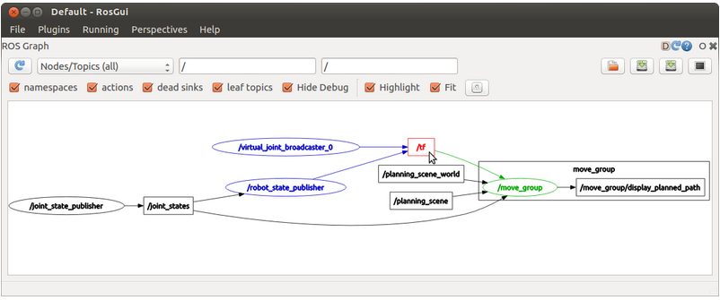

# Next Steps
## Overview
You did it. You finished the guided tutorials. You likely learned a lot about
ROS and Python along the way. Hopefully you take some pride in your
accomplishment because learning to use ROS is no easy feat.

In this document, we'll present some ideas on how you could improve upon this
controller in order to expand on your ROS knowledge. We'll also give you some
tips and insight into additional topics you may encounter while working on your
own improvments.

## Ideas for Improvement
Feel free to use some of these ideas in the list, or go off and do your own
thing. This is designed to be open ended. You can build on the existing
controller or tear it down completely to make your own system.

### Self Avoidance System
The snake dies when it intersects with itself. You could create a new node to
sit between the goal relay and the position controller that will re-route the
snake if it is detecting a collision.

You could also remove the goal relay completely and design your own waypoint
controller that uses an graph based planning algorithm. For example, grassfire,
Dijkstra, or A star algorithms could all work.

If you want to get really fancy, you could consider the fact that the snake is
going to move as you execute the motion plan, so it may be acceptible to
intersect with the current position by some amount. Cutting corners like this
may save you valuable time if you're trying to maximize the score in a fixed
time frame.

### Wall Avoidance System
Another way that the snake dies is by intersecting with the wall. Commonly, this
is an issue when the snake approaches a goal near the wall in a way that doesn't
leave room for the snake to get out.

Like the above suggestion, you could create a new node between the goal relay
and position controller that re-routes the snake to a safe path. You could
also remove it completely and build it right into a fancier waypoint controller.

This could be built in addition to the self avoidance system using some sort of
planning algorithm that looks past reaching the next goal. For example RRT could
be used to find a safe path to the goal and an arbitray secondary location.

### Machine Learning
If you have experience with machine learning, you can probably apply it to this
problem. If you want GPU acceleration, take a look at modifying the Docker
scripts to use the [NVIDIA Container Toolkit](https://github.com/NVIDIA/nvidia-docker).
You may also run into issues with Python versions. There is a way to run ROS
with Python 3, but it requires a little bit of extra work. You can also develop
a multicontainer application and use Docker's networking tools to bridge between
this container and another running your machine learning stack. These are all
more advanced topics so we won't discuss how to do that in this document.

## Tips and Insights for Making New Nodes
### Portability
Beginners sometimes like to put all the logic for a system in one big node. This
is like if we put the heading, position, and goal relay nodes all in one place.
Technically, it will work fine with ROS if you have all your inputs and ouputs
set up correctly. However, it may not be the _best_ way to do things.

A really big benefit of ROS is how modular a system of nodes can be. Let's say
that you want to experiment with using a more intelligent waypoint controller
rather than just feeding in the goal position. You can write a new node for that
purpose and create a different launch file to use it. You could even make the
launch file pick the correct node programatically using commandline arguments!

It can also be advantagous to split things up for debugging purposes. If we put
all the logic for the controller in once node, then started having issues with
the heading control to the system, we'd need to go in and put print statements
or use a debugger in order to check the output. With the way we wrote it with
ROS, we can use commandline tools like `rostopic echo` in order to validate the
output. We could also isolate the one node we want to verify and perform unit
testing using `rostopic pub`.

Lastly, using ROS messages defines a command standard for nodes to communicate.
If you put everything in one big node, you probably will use internal Python
data structures to send information back and forth. This may make things more
difficult to maintain later on if you don't define these interfaces very
clearly.

As a general rule of thumb, split up logic into multiple nodes if:
- there are multiple logical steps that may be re-used or replaced in the future
- you want to be able to debug data sent between two logical steps using ROS
- The data sent between multiple logical steps has a complex format that a ROS
message exists for

### Naming Conventions
Here is the general rule of thumb for naming ROS specific items:
- packages: `snake_case`
- nodes: `snake_case`
- topics: `snake_case/with/optional/nesting`
- parameters: `snake_case/with/optional/nesting`

For Python, follow the [PEP 8 guidelines](https://www.python.org/dev/peps/pep-0008/):
- classes: `PascalCase`
- variables: `snake_case`
- "private" variables: `_snake_case_with_leading_underscore`
- "constant" variables: `CAPITALIZED`
- functions: `snake_case`
- "private" functions: `_snake_case_with_leading_underscore`

### Picking Message Types
Generally, you want to use a ROS message type that is intended for the
application you have in mind. For example, the `Vector3` message and the `Point`
message both have three fields, `x`, `y`, and `z`. However, `Vector3` is
designed to represent vectors in 3D space, while `Point` is designed to
represent a point in 3D space.

Another bad thing is to use a message and use the fields for different purposes
than intended. For example, ROS has a `Quaternion` message, but no standard
`EulerAngle` message. If you took a `Quaternion` message and made the `x`,`y`,
and `z` field correspond to roll, pitch, and yaw, that would be really confusing
for future users. It is also generally advisable to use Quaternions over Euler
angles since there is no confusion about how to interpret them.

ROS has some standard message types that you can look at online:
- [std_msgs](http://wiki.ros.org/std_msgs)
- [common_msgs](http://wiki.ros.org/common_msgs)

If you feel really adventurous, you can define your own messages, but that is
outside the scope of this document.

### Threading Notes
Earlier, we discussed that for rospy, all of the subscriptions happen in their
own threads. This can be an issue if you have code like the following:
```python
def callback_one(self, msg):
    self.important_variable = msg.data

def callback_two(self, msg):
    # Check that we can take the log of important_variable
    if self.important_variable > 0:
        self.some_variable = msg.data * math.log(self.important_variable)
```

What _could_ happen is that `callback_two` gets called and performs the check.
Then `callback_one` gets called and sets `important_variable` to a negative
number. Then, the execution goes back to `callback_two` and we crash the
program since `math.log` throws an error if you try to take the natural
logarithm of a negative number.

You could also have issues with something like iterating through an array if
the array is being changed in a different callback.

There are a few ways to get around this:
- use locks
- use atomic operations

#### Locks
Locks (similar to mutex's in other langues) let you enforce rules about how
threads can access shared data. Let's see what the earlier example looks like
when lock are being used:
```python
import threading
# ...
self.lock = threading.Lock()
# ...

def callback_one(self, msg):
    self.lock.acquire()
    self.important_variable = msg.data
    self.lock.release()

def callback_two(self, msg):
    self.lock.acquire()
    # Check that we can take the log of important_variable
    if self.important_variable > 0:
        self.some_variable = msg.data * math.log(self.important_variable)
    self.lock.release()
```

Locks are provided through the `threading` library, and you can read more about
them [online](https://docs.python.org/2/library/threading.html#lock-objects).

#### Atomic Operations
This is a more advanced concept, but it can make things a little bit simpler if
you understand it well.

In CPython atleast, there is something called the Global Interpreter Lock or
GIL. This essentially makes a restriction that multithreaded programs can really
only run in a single thread. Instead it switches back and forth between running
bytecode commands from the different "threads". The benefit is that if you know
a certain command is atomic (meaning it is one bytecode instruction), you don't
need to worry about breaking things as much.

This is why it was safe in the `snake_position_controller` node to make a local
copy. Making a local copy of a tuple is atomic. Tuples are immutable, meaning
that when it is updated in another thread, a new one is made, the variable is
changed to point to the new one, and the old one is thrown out if nothing else
is still using it. For our case, we were still using it with our local variable,
so it was kept safe for us. Lists are a good example of a datatype that is not
immutable. If our X and Y values had been stored in a list, we would not have
been thread safe.

A full list of atomic operations are proved [online](https://docs.python.org/2/faq/library.html#what-kinds-of-global-value-mutation-are-thread-safe).

### Debugging
There are going to be many times where ROS wants to make you slam your head into a wall.
Luckily there are tools to reduce that frustration and help determine the issue.

This is a short list of the many options avaliable:
- [rqt_graph](http://wiki.ros.org/rqt_graph): This ROS package allows users to 
visualize the ROS computation graph. In other words, you can see what nodes 
are active as well as
how nodes are communicating. Here is an example of an RQT graph:

- [roswtf](http://wiki.ros.org/roswtf): This ROS package is a general
debugging tool that finds issues by searching your workspace. Additionally
it has a funny name.
- [rostopic](http://wiki.ros.org/rostopic): This command-line tool can be used 
in debugging nodes. The two commands you might find most useful are
`echo` and `pub`, which help in manually receiving and sending messages. This
is espcially helpful for testing or when running nodes independently.
- [rosnode](http://wiki.ros.org/rosnode): This is another useful command-line
tool for debugging nodes, except it deals with specific nodes. You can use
`info` to print out various information about a given node.
- [Python Specific Debugger (PDB)](https://docs.python.org/3/library/pdb.html):
This a tool built to help debug python applications. It was used heavily in
making the `snakesim` package.

## Additional Resources and Getting Help
If you're part of the Autonomous Robotics Club of Purdue, you can post questions
to other members on Slack. This is a really good way to get quick feedback.

If you're looking for other resources online, there are a few official ones:
- [ROS Wiki](http://wiki.ros.org/)
- [ROS Answers](https://answers.ros.org/questions/)
- [ROS Discourse](https://discourse.ros.org/)

And of course, there are always other forum sites like [StackOverflow](https://stackoverflow.com/).
You can also find resources on YouTube that may help with the explanation of
general concepts.

If you're looking for a textbook like experience, there is an excellent free
book called [A Gentle Introduction to ROS](https://www.cse.sc.edu/~jokane/agitr/agitr-letter.pdf).

## Give Us Feedback
Feel free to give us feedback on this tutorial. If you are part of the
Autonomous Robotics Club of Purdue, let us know about any potential improvements
or errors you found through Slack. If you have an interest in creating your own
tutorial to add to this package, lets us know.

If you're outside of the club and found this useful, please let us know. You can
give the repo some stars on [GitHub](https://github.com/purdue-arc/arc_tutorials).
You can also create Issues for any problems you found, or open up a PR if you
have a fix. If you want to get in contact with the maintainer, send us an email
through [autonomy@purdue.edu](mailto:autonomy@purdue.edu).
